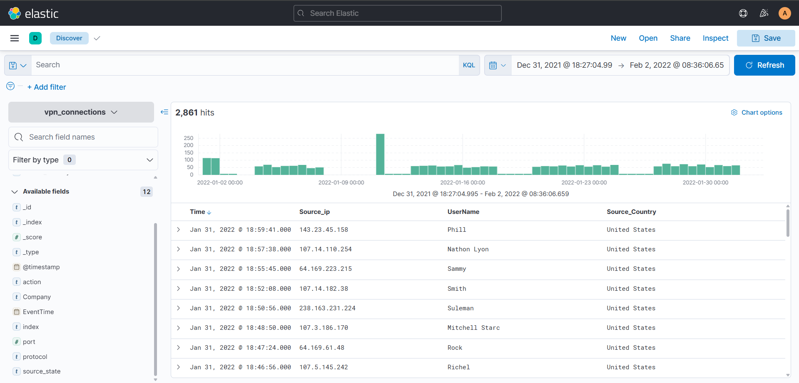

# Investigating with ELK: SOC Analyst Case Study

## Scenario
Security Operations Center (SOC) teams frequently utilize the Elastic Stack (ELK) as a SIEM solution to store, search, and visualize log data. This case study documents the setup, architecture comprehension, and subsequent log analysis using ELK to detect anomalies.

## Objective
To navigate the Elastic Stack environment, understand its data ingestion pipeline, and utilize Kibana for log filtering, threat hunting, and visual dashboard creation.

## Tools Used
* Elastic Stack (Elasticsearch, Logstash, Kibana)
* Data Shippers (Beats)

## Skills Demonstrated
* SIEM Architecture Comprehension
* Log Pipeline Analysis

---

## Investigation Process

### Task 1: Introduction to Elastic Stack
**Objective:** Establish the baseline purpose of ELK within a security context.
* **Overview:** While initially designed for application performance monitoring, ELK is deployed by SOC teams for security operations. Its ability to collect data from any source, search it, and visualize it in real-time makes it highly effective for log investigations.

### Task 2: Elastic Stack Component Overview
**Objective:** Map the log data pipeline from endpoint collection to analyst visibility.
* **Component Breakdown:**
  * **Beats:** Host-based agents deployed on endpoints (e.g., Winlogbeat for Windows logs, Packetbeat for network traffic). They act as data shippers, pushing local logs into the pipeline.
  * **Logstash:** The data processing engine. It utilizes a configuration file split into three sections: *Input* (defining the source), *Filter* (parsing and normalizing the raw logs), and *Output* (routing the data to the database or interface).
  * **Elasticsearch:** The core full-text search and analytics engine. It stores the parsed data as JSON-formatted documents, allowing analysts to perform rapid queries and correlations via a RESTful API.
  * **Kibana:** The web-based visualization tool. This is the primary interface for an analyst to investigate data streams, build dashboards, and interact with the data stored in Elasticsearch.
* **Data Flow Architecture:** Endpoints (Beats) -> Data Processing (Logstash) -> Database Indexing (Elasticsearch) -> Analyst Interface (Kibana).

---
### Task 3: Lab Connection & Environment Setup
**Objective:** Establish secure access to the target Elastic Stack instance.
* **Action:** Deployed the simulated ELK instance and connected to the Kibana interface via the provided lab environment.
* **Notes:** Successfully authenticated into the Kibana dashboard using the provided analyst credentials. Verified that the web interface was responsive and ready for log querying and threat hunting in the subsequent phases of the investigation.

---
### Task 4: Log Triage & Baseline Analysis (Discover Tab)
**Objective:** Utilize Kibana's Discover interface to triage VPN logs, establish normal traffic baselines, and identify initial visual anomalies.
* **Action:** Interacted with raw log data to filter out noise, build custom data tables, and extract initial metrics regarding user access patterns.
* **Process:**
  * **Index Configuration:** Selected the `vpn_connections` index pattern to specifically target the logs relevant to the investigation.
  * **Time Filtering:** Adjusted the time filter from December 31, 2021, to February 2, 2022, capturing a total baseline of 2,861 connection events.
  * **Visual Triage (Timeline):** Analyzed the event count timeline and identified a distinct log spike occurring on January 11th, marking it for further investigation.
  * **Data Structuring:** Converted the raw JSON log outputs into a clean, readable table by isolating key fields (`IP`, `UserName`, and `Source_Country`). This significantly reduced noise and focused the view on actionable data.
  * **Advanced Filtering:** Applied combined boolean logic to isolate specific behaviors, such as tracking connections from a specific high-volume IP (`238.163.231.224`) while actively excluding expected traffic from the state of New York.
* **Initial Investigation Findings:**
  * **High-Volume Indicators:** Identified user `James` as responsible for the overall maximum traffic, and IP `238.163.231.224` as generating the maximum number of connections.
  * **Spike Attribution:** Traced the anomalous log spike on January 11th directly to source IP `172.201.60.191`.
  * **Targeted Correlation:** Correlated user `Emanda`'s activity to find maximum hits originating from source IP `107.14.1.247`.

---

### Task 5: Threat Hunting with KQL (Kibana Query Language)
**Objective:** Utilize KQL syntax to perform granular log filtering, isolate specific user activities, and detect unauthorized access attempts.
* **Action:** Applied free-text searches, field-based parameters, and boolean logic to execute targeted queries against the VPN log dataset.
* **Process & Techniques:**
  * **Free-Text & Wildcards:** Utilized broad terms and wildcards (e.g., `*`) to perform wide-net searches across all indexed document fields.
  * **Field-Based Filtering:** Narrowed the scope of the investigation by querying specific key-value pairs (e.g., `Source_ip: 238.163.231.224`).
  * **Logical Operators:** Chained conditions using `AND`, `OR`, and `NOT` to build complex, highly specific queries to filter out benign traffic.
* **Investigation Findings:**
  * **Targeted User Correlation:** Executed a compound query to isolate US-based traffic for specific high-interest users. The query targeting the United States and users `James` or `Albert` successfully returned 161 precise connection events.
  * **Post-Termination Access Detected:** Investigated the account activity of user `Johny Brown`, who was officially terminated on January 1, 2022. By querying his username against events occurring after his termination date, the search revealed **1** VPN connection. This indicates a failure in the offboarding/account disablement process and represents a critical security incident.

---
### Task 6: Data Visualization & Trend Analysis
**Objective:** Translate raw VPN log data into visual metrics to rapidly identify authentication trends, geographic anomalies, and potential brute-force activity.
* **Action:** Utilized Kibana's Visualization tab to build pie charts, data tables, and field correlations to extract actionable intelligence from the `vpn_connections` index.
* **Process & Techniques:**
  * **Data Correlation:** Used the correlation feature to map relationships between multiple fields. Specifically, mapped `Source_Country` against `Source_IP` to visualize the geographic distribution of incoming traffic.
  * **Table Construction:** Built structured data tables to cross-reference multiple fields simultaneously (e.g., mapping top IP addresses to their respective countries alongside the total record count).
  * **Targeted Threat Visualization:** Constructed a specialized table specifically filtered to display the exact users and IP addresses involved in *failed* connection attempts.
* **Investigation Findings:**
  * **Top Targeted Account:** Through the failed attempts visualization, I successfully identified user **Simon** as the account experiencing the highest volume of failed login attempts, strongly indicating a targeted brute-force or credential stuffing attack.
  * **Failed Login Count:** Confirmed exactly **274** failed VPN connection attempts occurred during the month of January.

``)*
---
### Task 7: Dashboard Creation & Continuous Monitoring
**Objective:** Consolidate individual visualizations and saved searches into a centralized dashboard for real-time VPN log monitoring and threat detection.
* **Action:** Utilized Kibana's Dashboard application to aggregate previously created metrics (failed logins, geographic distribution, timeline spikes) into a single, cohesive pane of glass.
* **Process & Techniques:**
  * **Dashboard Initialization:** Created a new custom dashboard workspace dedicated specifically to VPN access logs.
  * **Widget Integration:** Imported the saved data views, pie charts, and data tables from the visualization library into the central dashboard.
  * **Layout Optimization:** Organized the visual elements logically to ensure analysts can immediately identify anomalies at a glance (e.g., placing the "Failed Login Attempts" counter and "Top Target Accounts" table prominently).
* **Investigation Conclusion:** * Successfully built a functional, production-ready SOC dashboard capable of tracking VPN authentication spikes, isolating targeted users, and mapping malicious IP geographies. 
  * Demonstrated full-cycle SIEM capabilities: from understanding the raw data pipeline and executing KQL queries, to visualizing trends and establishing a continuous monitoring environment.

 ``

---
### Conclusion
This investigation successfully demonstrated the utility of the Elastic Stack within a Security Operations Center. By triaging raw VPN logs, filtering data with KQL, and constructing targeted visualizations, I was able to transition from baseline network noise to actionable threat intelligence. Ultimately, this allowed for the identification of a targeted brute-force campaign and exposed gaps in the employee offboarding process. This case study reinforces critical SIEM methodologies, log analysis proficiency, and the value of continuous monitoring.
